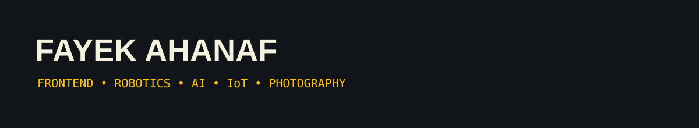
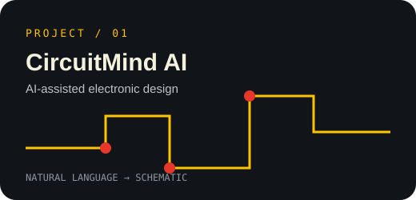
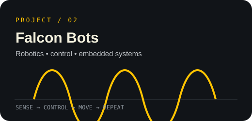
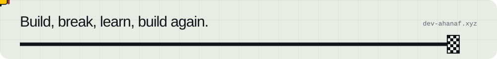

<div align="center">



<br/>

<a href="https://ahanaf-portfolio.vercel.app"></a>
<a href="https://linkedin.com/in/pro-ahnaf"></a>
<a href="mailto:ahanaffayek@gmail.com"></a>

<br/><br/>


</div>

### About

```text
name       Fayek Ahanaf
tagline    Building with Code, Creating with Vision
studying   BSc in Computing & Information Systems, Daffodil International University (DIU)
focus      Autonomous Robotics, Web Engineering, AI Tools & Visual Media
leads      Falcon Bots — DIU CIS Robotics Team (National Silver Medalist @ WRG 2026)
loop       build -> break -> learn -> build again
```

I like the place where software meets the real world: an AI app that answers a real question, a clean interface someone actually enjoys using, a robot that finishes the lap without leaving the line.

<div align="center">

</div>

### Track Record & Achievements

<div align="center">

</div>

<div align="center">

</div>

### Featured Projects

<div align="center">
<a href="https://github.com/dev-ahanaf/circuitmind-ai"></a>
<a href="https://github.com/dev-ahanaf"></a>
</div>

<br/>

Web engineering & robotics work live alongside visual media production: responsive frontends in HTML, CSS, JavaScript, React, Next.js, and Tailwind CSS, plus WordPress & Shopify builds. Explore the full interactive showcase at [ahanaf-portfolio.vercel.app](https://ahanaf-portfolio.vercel.app).

<div align="center">

</div>

### Contribution Activity

<div align="center">

</div>

<div align="center">

</div>

### Toolbox & Analytics

<div align="center">


<br/><br/>


<br/><br/>



</div>

