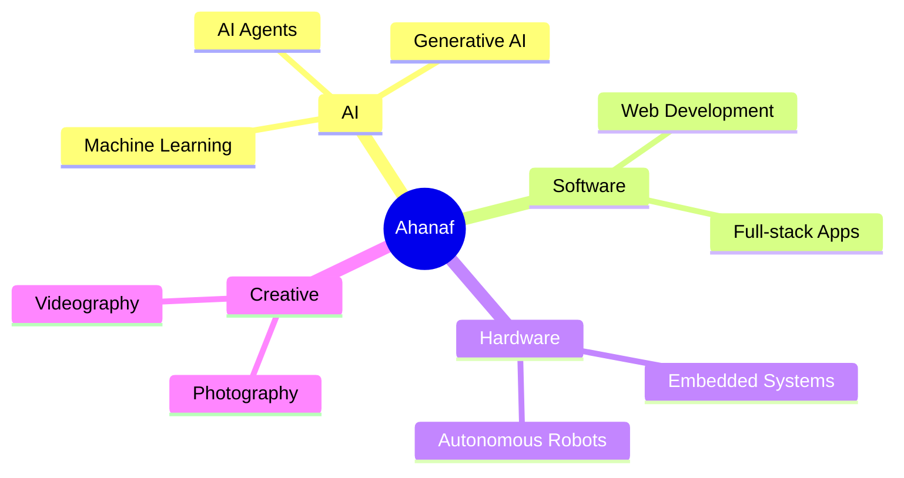

<div align="center">


<br/>

**CIS Student** &nbsp;|&nbsp; **AI & Web Developer** &nbsp;|&nbsp; **Robotics Team Lead**

<br/>

<a href="https://github.com/dev-ahanaf"></a>
<a href="https://dev-ahanaf.xyz"></a>
<a href="https://linkedin.com/in/pro-ahnaf"></a>
<a href="mailto:ahanaffayek@gmail.com"></a>

<br/><br/>


</div>

<br/>

## 👋 About Me

```ts
const ahanaf = {
  name: "Fayek Ahanaf",
  studying: "BSc in Computing & Information Systems @ Daffodil International University",
  role: ["AI & Web Developer", "Robotics Team Lead"],
  loves: ["Software meeting the real world", "Robots that move", "Visual storytelling"],
  motto: "Build -> Break -> Learn -> Build Again",
};
```

I enjoy turning ideas into practical technology, especially where **software meets the real world**: AI-powered apps, clean web interfaces, and robots that actually run laps.



<br/>

## ⚡ What I Build

<table>
<tr>
<td width="50%" valign="top">

### 🧠 AI & Intelligent Systems
Applications that use AI to solve practical problems.


</td>
<td width="50%" valign="top">

### 🌐 Web Applications
Responsive, useful and polished digital experiences.


</td>
</tr>
<tr>
<td width="50%" valign="top">

### 🔧 Robotics & Embedded
Designing and programming autonomous robots.


</td>
<td width="50%" valign="top">

### 🎨 Creative Technology
Technology combined with visual storytelling.


</td>
</tr>
</table>

<br/>

## 🏆 Highlights

<div align="center">

<table>
<tr>
<td align="center" width="25%">
<h1>🥈</h1>
<b>Silver Medal</b><br/>
<sub>World Robot Games 2026<br/>Bangladesh National Qualifier</sub>
</td>
<td align="center" width="25%">
<h1>🇯🇵</h1>
<b>International Round</b><br/>
<sub>Qualified for<br/>WRG 2026 Japan</sub>
</td>
<td align="center" width="25%">
<h1>🤖</h1>
<b>Programmable Line Robot</b><br/>
<sub>Senior Category</sub>
</td>
<td align="center" width="25%">
<h1>🎓</h1>
<b>CIS</b><br/>
<sub>Daffodil International<br/>University</sub>
</td>
</tr>
</table>

</div>

<br/>

## 🚀 Featured Projects

<table>
<tr>
<td width="50%" valign="top">

### 🔌 CircuitMind AI
An AI-assisted electronics design workspace exploring circuit design workflows, schematic generation, component information and embedded code generation.


<a href="https://github.com/dev-ahanaf/circuitmind-ai"></a>

</td>
<td width="50%" valign="top">

### 🦅 Falcon Bots
A robotics team from **DIU CIS** focused on programmable line-following robots and embedded systems.

🥈 **Silver Medal**, World Robot Games 2026 (Bangladesh National Qualifier)
🇯🇵 Qualified for the International Round in Japan


</td>
</tr>
<tr>
<td width="50%" valign="top">

### 🌐 Web Projects
Frontend and web development projects exploring modern interfaces, responsive layouts and practical applications.


</td>
<td width="50%" valign="top">

### 🔭 What's Next
Currently exploring projects around **AI x Robotics x Software**, with a focus on building things that are useful beyond a demo.


</td>
</tr>
</table>

<br/>

## 🛠️ Tech Stack

<div align="center">

<br/>
<br/>


</div>

<br/>

## 🎯 Currently

<table>
<tr>
<td width="50%" valign="top">

**🎓 Education**
BSc in Computing & Information Systems, Daffodil International University

**🔭 Focus**
AI, Web Development, Robotics, Embedded Systems

</td>
<td width="50%" valign="top">

**📚 Learning**
Machine Learning, Advanced React, TypeScript, AI-powered Applications

**🛠️ Building**
AI projects, robotics projects, open source projects

</td>
</tr>
</table>

<br/>

## 📊 GitHub Stats

<div align="center">


<br/>


</div>

<br/>

## 🐍 Contribution Activity

<div align="center">


</div>

<br/>

## 🤝 Let's Connect

<div align="center">

I'm always open to talking about AI, robotics, web projects and new collaborations.

<br/>

<a href="https://dev-ahanaf.xyz"></a>
<a href="https://linkedin.com/in/pro-ahnaf"></a>
<a href="mailto:ahanaffayek@gmail.com"></a>

<br/><br/>

### `Build -> Break -> Learn -> Build Again.`

<br/>


</div>


